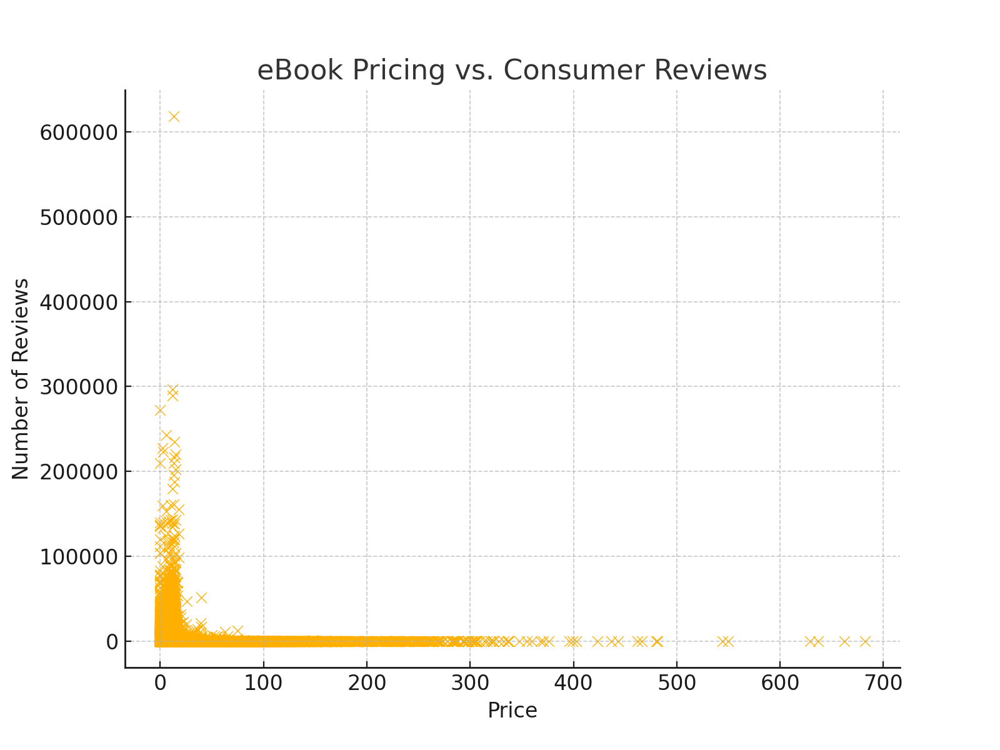

<!DOCTYPE html>
<html lang="en">
<head>
    <meta charset="UTF-8">
    <meta name="viewport" content="width=device-width, initial-scale=1.0">
</head>
<body>

<h1>Data Analysis for Amazon Kindle Book Sales</h1>

This project involves data analysis for Amazon Kindle book sales, focusing on uncovering patterns, trends, and insights that can help improve book performance on the platform. The analysis uses Python and various data visualization libraries to interpret and present the findings effectively.

<h2>Table of Contents</h2>
<ul>
    <li><a href="#about-the-project">About the Project</a>
        <ul>
            <li><a href="#built-with">Built With</a></li>
        </ul>
    </li>
    <li><a href="#getting-started">Getting Started</a>
        <ul>
            <li><a href="#prerequisites">Prerequisites</a></li>
            <li><a href="#installation">Installation</a></li>
        </ul>
    </li>
    <li><a href="#usage">Usage</a>
        <ul>
            <li><a href="#data-analysis">Data Analysis</a>
                <ul>
                    <li><a href="#sales-trend-analysis">Sales Trend Analysis</a></li>
                    <li><a href="#genre-performance">Genre Performance</a></li>
                    <li><a href="#customer-review-insights">Customer Review Insights</a></li>
                </ul>
            </li>
        </ul>
    </li>
    <li><a href="#roadmap">Roadmap</a></li>
    <li><a href="#contributing">Contributing</a></li>
    <li><a href="#license">License</a></li>
    <li><a href="#contact">Contact</a></li>
    <li><a href="#acknowledgements">Acknowledgements</a></li>
</ul>

<h2 id="about-the-project">About the Project</h2>

This project aims to provide a comprehensive analysis of Amazon Kindle book sales data. By leveraging this analysis, authors, publishers, and marketers can make informed decisions to optimize their book listings and strategies on Amazon.

<h3 id="built-with">Built With</h3>
<ul>
    <li><a href="https://www.python.org/">Python</a></li>
    <li><a href="https://pandas.pydata.org/">Pandas</a></li>
    <li><a href="https://matplotlib.org/">Matplotlib</a></li>
    <li><a href="https://seaborn.pydata.org/">Seaborn</a></li>
    <li><a href="https://jupyter.org/">Jupyter Notebook</a></li>
</ul>

<h2 id="getting-started">Getting Started</h2>

To get started with this project, follow these steps:

<h3 id="prerequisites">Prerequisites</h3>

Ensure you have the following installed:

<ul>
    <li>Python 3.x</li>
    <li>Jupyter Notebook</li>
</ul>

<h3 id="installation">Installation</h3>
<ol>
    <li>Clone the repo:
        <pre><code>git clone https://github.com/your_username/amazon-kindle-analysis.git</code></pre>
    </li>
    <li>Install the required Python packages:
        <pre><code>pip install -r requirements.txt</code></pre>
    </li>
</ol>

<h2 id="usage">Usage</h2>

Open the Jupyter Notebook and execute the cells to run the analysis.

<pre><code>jupyter notebook Data_Analysis_for_Amazon_Kindle_Book.ipynb</code></pre>

<h3 id="data-analysis">Data Analysis</h3>

This section highlights key findings from the analysis performed on the Kindle book sales data.

<h4 id="sales-trend-analysis">Distribution of Stars</h4>

This analysis showcases the distribution of star ratings given to books. It reveals the frequency of each star rating, helping to understand customer satisfaction.

<h4 id="genre-performance">eBook Pricing vs. Consumer Reviews</h4>

This scatter plot shows the relationship between eBook pricing and the number of consumer reviews. It provides insights into how pricing strategies might influence customer feedback.

<h4 id="customer-review-insights">Customer Reviews, Ratings, and Bestseller Status</h4>

This scatter plot illustrates customer reviews and ratings, with an emphasis on whether the book is a bestseller. It helps in understanding how bestseller status might correlate with ratings and reviews.

<h2 id="roadmap">Roadmap</h2>
<ul>
    <li>Initial Data Cleaning and Preprocessing</li>
    <li>Exploratory Data Analysis (EDA)</li>
    <li>Visualization of Sales Trends and Genre Performance</li>
    <li>Implementation of Predictive Models for Sales Forecasting</li>
    <li>Optimization of Book Listings Based on Analysis</li>
</ul>

<h2 id="contributing">Contributing</h2>

Contributions are welcome! Please follow the standard procedure to contribute.

<h2 id="license">License</h2>

Distributed under the MIT License. See <code>LICENSE.txt</code> for more information.

<h2 id="acknowledgements">Acknowledgements</h2>
<ul>
    <li><a href="https://www.python.org/">Python</a></li>
    <li><a href="https://pandas.pydata.org/">Pandas</a></li>
    <li><a href="https://matplotlib.org/">Matplotlib</a></li>
    <li><a href="https://seaborn.pydata.org/">Seaborn</a></li>
    <li><a href="https://jupyter.org/">Jupyter Notebook</a></li>
</ul>

</body>
</html>
